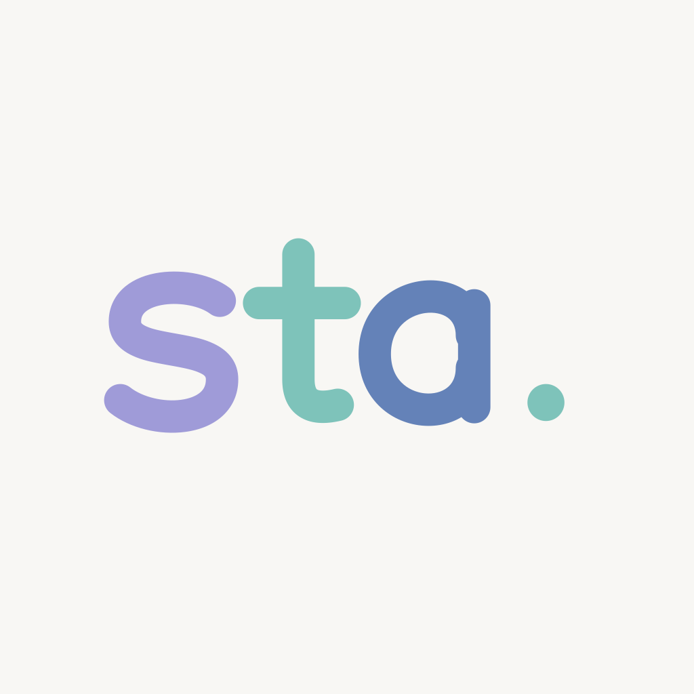

<p align="center">
  
</p>

<h1 align="center">sta.</h1>
<p align="center">科目を選んで、撮るだけ。</p>
<p align="center">SwiftUI · iOS 17+ · VisionKit · Local-first · MIT</p>

科目を選んでから撮る、学生向けのiOSドキュメント整理アプリ。Swift / SwiftUI、iOS 17以降。バックエンド・ログイン・外部ライブラリはありません。

## 開く

`Tagbum.xcodeproj` をXcodeで開き、`Tagbum` schemeを選んで実行します。表示名は **sta.** です。実機で動かす場合はSigning & Capabilitiesで自分のDevelopment Teamを設定し、Bundle Identifierを自分専用の一意な値（例: `com.yourname.sta`）に変更してください。仮の `com.tagbum.app` はそのままでは登録できない場合があります。

Xcode 27ではシミュレーター画面はDevice Hubに表示されます。

## 操作

- 起動 → 科目一覧。右上の＋ → 科目名入力 → 作成。
- 科目 → 右下のスキャン → Apple標準スキャナーで撮影・保存。現在の科目へ直接保存。
- 写真取り込みは右上メニュー、またはスキャンボタンの長押しから。
- 資料をタップ → 左右スワイプで前後へ。上部の科目タブで別科目の最新資料へ移動。
- 資料をシングルタップすると操作UIを表示／非表示。ピンチとダブルタップで拡大。
- 科目カードの長押しで名前編集・削除。資料の長押し、またはビューアのごみ箱で資料削除。
- 削除だけは取り消せないため確認を表示。保存成功は短い通知で表示。

カメラの自動認識・台形補正・連続撮影はVisionKitを利用しているため、実機で確認してください。シミュレーターではPhotosから取り込めます。

## 構成

- `Models`: Album / Document / Library。UUIDと相対画像パスで管理。
- `Services/LibraryStore.swift`: メタデータ管理と原子的なJSON書き込み。破損時は上書きを防止。
- `Services/ImageStorage.swift`: actorによる画像保存、ImageIOによる縮小読み込み、上限付きキャッシュ。
- `Services/DocumentScanner.swift`: VisionKitのラッパー。
- `Views`: 科目一覧、編集、科目詳細、資料ビューア。
- `Components`: フォルダカード、サムネイル、拡大ビュー、配色。

画像はApplication Support/Tagbum内のJPEG、メタデータはlibrary.jsonに保存します。画像とメタデータの保存責務を分離し、将来のiCloud同期を追加できる構成ですが、同期・競合解決は未実装です。

## サンプル・テスト

Debug起動引数 `--demo` で4科目・各3枚のサンプルを表示します。通常データとは別のStaDemoディレクトリに保存し、Releaseビルドにはサンプル作成処理を含めません。

`TagbumTests` は保存・再読み込み・撮影順・科目間分離・削除・破損データの保護を確認します。`TagbumUITests` は科目作成・編集、資料スワイプ、科目切替、資料削除を確認します。テストは専用のStaUITestsディレクトリを使います。

## ロゴ

`Design/sta-logo.svg` が編集可能なベクター原稿です。ポートフォリオの幾何学的な丸みと紫・ミントの配色を参考に、sta.専用に作図しました。アプリのヘッダーとホーム画面アイコンに組み込んでいます。

PNGの再生成:

```sh
swift Scripts/render-brand.swift "$PWD"
```

## アイコンをWeb・ポートフォリオで使う

- [SVGロゴ](Design/sta-logo.svg): 背景が透明な横長ロゴ。サイズを変えても鮮明です。
- [アプリアイコンPNG](Tagbum/Assets.xcassets/AppIcon.appiconset/sta-icon.png): 1024 × 1024。作品カードやSNS向け。

Webサイトでは、PNGを `public/images/projects/sta-icon.png` にコピーして表示できます。

```html
<a href="https://github.com/h-kurashina/sta.">
  
</a>
```

GitHubのREADMEでは相対パスで表示できます。

```md

```

他のリポジトリから直接参照する場合は、以下のURLを使えます。

```text
https://raw.githubusercontent.com/h-kurashina/sta./main/Design/sta-logo.svg
```

## ライセンス

[MIT License](LICENSE)。コードと同梱のオリジナル画像を公開しています。再配布する場合は、著作権表示とライセンス文を保持してください。
